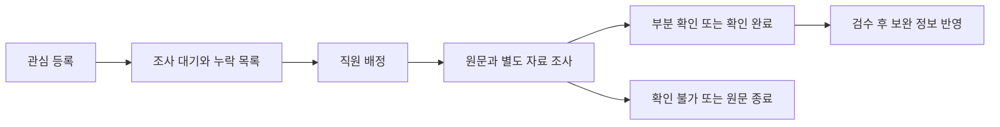

# 관리자 운영 기획

사용자 정책: 관리툴 디자인은 제공되는 샘플을 기준으로 별도 작업한다. 기존 `/admin`이 있으므로 처음부터 전부 재작성하지 않는다. 샘플 수령/선택 여부는 GLI-046에서 확인한다. GS-021은 전체 운영 도구 통합 작업이다.

| 모듈 | 현재 재사용 부분 | 앞으로 연결할 업무 |
|---|---|---|
| 출처 | sources, 승인/중지 API, import form | 국가·필드 mapping·수집 범위·최근 성공/실패·비용 |
| 수집 | ingestion runs, raw snapshots, worker | on-demand 검색 저장, source별 확인, 실패 재처리 |
| 자산 | listings, review decisions, 공개 상태 | 원문/직원 보완 정보 분리, 자료작성 시점, gallery, 프로젝트 |
| 관심 조사 | favorites | 관심 이벤트→누락 항목 조사 task→직원 배정→증거 입력 |
| Trust | deterministic score/review | 8등급 근거·규칙 버전·검수 기록 |
| 회원 | users/memberships/usage | 실제 인증, 이용권/권한, 비용 통제 |
| Cash/결제 | checkout/webhook ledger | 선불 원장, 결제사 정산/취소/환불, 예외 처리 |
| 상담 | case/message/status/notification | 운영자 지정, 우선순위, SLA, 실제 공개 UI 연결 |
| 뉴스/공지 | 정적 콘텐츠와 route | 입력·미리보기·수정·카테고리·예약·게시·회수·삭제 |
| 감사/복원 | audit/readiness/backup evidence | 실제 운영 실행과 복원 증거, 권한별 조회 |

## 역할 제안

GLI가 담당자를 지정한다. 역할 후보: 소스 운영자, 조사 담당자, 게시 검수자, 콘텐츠 편집자, 회원/상담 담당자, 재무 담당자, 시스템 관리자. 사람 수와 조직 구조는 미확정이다. API마다 최소 역할과 사용자/자산 범위를 명시한다. 역할 이름을 새 UI에 임의 반영하지 않는다.

## 관심 조사 목표 흐름

한 원문을 여러 회원이 저장하면 조사 task에 관심 수를 연결한다. 서로 다른 원문을 같은 주소라는 이유로 합치지 않는다. 직원 보완에는 작성자·근거·확인 시각·검토 상태를 저장한다. source 원문 값은 유지한다.

## 콘텐츠 목표 흐름

뉴스/공지는 draft → review → scheduled/published → unpublished/archived 형태로 관리한다. 예약 작업의 중복 실행과 수정 충돌을 처리하고 기존 URL을 유지한다. 삭제 방식과 보존 기간은 운영 정책으로 확정한다. 현재 하드코딩은 공개 데모 표현이며 게시 API가 구현되었다는 뜻은 아니다.

## 운영 정보 노출 경계

자료작성 시점, 내부 메모, 원문 snapshot 위치, 수집 실패 원인, 모델 비용은 관리자용이다. 공개 카드에는 승인된 자산 정보·출처 링크·등급 등만 전달한다. 내부 정보를 숨기기 위해 미확인 필드를 확인 완료로 바꾸지는 않는다.
