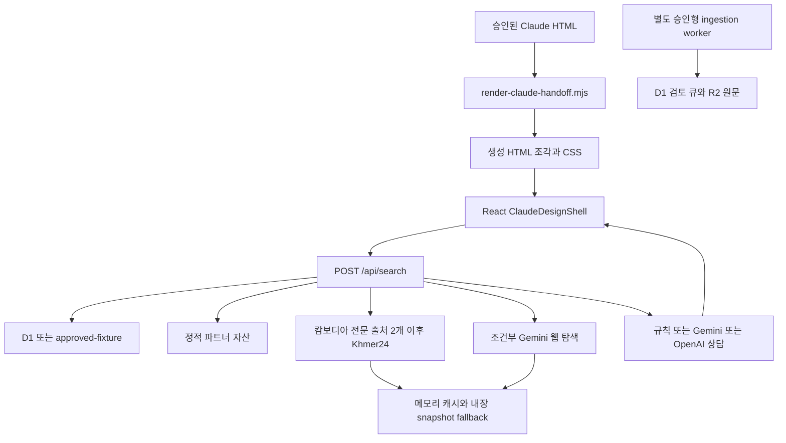

# 현재 상태와 데모 경계

2026-09-08 코드 정적 점검. 공개 서버나 외부 포털의 오늘 동작을 확인한 보고서가 아니다.

## 실행 경로

## 확인된 주요 차이

| 영역 | 코드에 있는 것 | 아직 같은 것으로 간주할 수 없는 것 |
|---|---|---|
| UI | ClaudeDesignShell과 생성 원본 기반 화면, 최신 승인 개선 | 모든 화면이 실제 DB와 연결된 상태 |
| 탐색 | 규칙 조건 추출, 외부 후보 병합, 상담 API | GPT가 먼저 의도를 해석해 3개 AI에 업무를 배정하는 구조 |
| 캄보디아 | 3개 출처 connector와 Gemini 제한 도메인 검색 | 오늘 각 출처에서 실제 수집에 성공했다는 증거 |
| 저장 | D1 저장소와 별도 ingestion 경로 | public live discovery의 모든 후보가 D1에 영구 저장됨 |
| 상세 | 원본 시안 ID는 생성 화면, 다른 ID는 getAsset 기반 화면 | 두 상세 화면의 완전한 시각·권한·데이터 통합 |
| 관심 자산 | D1 favorites API와 별도 목업 화면 | 현재 공개 하트가 항상 계정에 저장됨 |
| MY GLI | `/my` 구현이 존재 | 새 메뉴는 `coming-soon?section=my`로 이동하므로 완성된 공개 여정 아님 |
| 결제 | checkout/event 저장소와 데모 결제 화면 | 화면의 `setPaid(true)`는 실제 결제 승인 아님 |
| 뉴스 | 정적 newsItems, 시안 생성 기사, 승인된 추가 기사 | 운영자가 입력·예약 게시하는 CMS |
| Trust | 내부 점수 계산과 공개 8등급 매핑 | 모든 데모 등급이 실사 증거로 계산된 등급 |
| 환율 | 외부 환율 API와 원통화·환산 범위 UI | 탐색 예산 계산까지 동일 환율 사용: search.ts는 1380 고정값 |
| 운영 | admin/승인/감사/재시도/복원증거 코드 | AWS 배포, 실제 운영자 지정, 백업 복구 실증 |

## 탐색의 구체적인 제한

- `DATA_MODE` 기본값은 `approved-fixture`. 공개 환경이 D1인지 이번에 확인하지 않았다.
- public route는 최대 100개 저장 자산을 읽고 조건을 파싱한다. 전체 시장의 개수를 계산하지 않는다.
- `LIVE_CAMBODIA_DISCOVERY`는 서버 플래그와 실행 환경에 의존한다. 다른 국가에서는 호출하지 않는다.
- 전문 출처 두 곳은 병렬 요청하고 Khmer24를 뒤이어 호출한다. 초기 충분한 후보가 있으면 더 보기를 기다리는 정책은 아직 완전 연결되지 않았다.
- WordPress URL은 `per_page=30`, connector 기본 수용 건수는 20이다. Khmer24 기본 URL은 rentals 경로다. 매매/도시/페이지별 검색면을 완전히 커버하지 않는다.
- public discovery의 `rawStore.put()`은 아무것도 저장하지 않는다. Map 캐시는 대개 10분이며 재시작·인스턴스 변경 시 사라진다.
- 실패뿐 아니라 0건이어도 내장 snapshot이 반환될 수 있다. `snapshot`과 `collected`를 구분해야 한다. 원문 날짜와 이번 `checkedAt`는 같은 의미가 아니다.
- Gemini 웹 탐색은 캄보디아에서 엄격 일치 후보가 6건 미만일 때 조건부 호출된다. 기본 최대 10건, hard cap 12건이다.
- 최종 규칙 검색은 18건 제한이 있다. UI의 후보 수는 현재 표시 결과 수이며 출처 전체 매물 수가 아니다.
- 새 외부 후보는 같은 원문 URL 반복을 제거한다. 다른 포털의 유사 주소·사진 매물은 합치지 않는 정책을 유지한다. URL 전체 소문자화의 경로 충돌 가능성은 GS-007에서 추적한다.
- 원문 날짜가 없을 때 Gemini 후보에 현재 시각을 넣는 처리와 connector의 수집시각 사용은 신선도 요구와 다르다. GS-009에서 추적한다.

## 상담과 과금

`extractCriteria`가 검색 전 조건을 결정한다. Gemini 대화는 최대 8턴, 턴당 1,200자이며 질문은 800자까지다. 화면의 요청 이해/탐색/검토/답변 단계는 모델별 호출 증거가 아니다. 실제 provider 분기는 Gemini, OpenAI, 규칙이며 Claude API adapter는 없다.

AI 검색 사용량 카운터는 있으나 Gemini 웹 탐색은 회원 사용량 확보 이전에 실행될 수 있다. 검색 비용과 상담 비용을 함께 제한하는 GS-012가 남았다. 모델 이름 기본값은 코드의 현 상태일 뿐 실제 계정에서 지원·설정된 모델을 검증한 값이 아니다.

## 문서에서 바로잡은 과거 해석

- PM_BOARD의 'favorite limits'는 역사 표현이다. 현재 정책과 코드의 `favoriteLimit: null`은 관심 자산 무제한이다.
- DEC-014의 'raw conversation replay 없음'과 현재 8턴 전송은 다르다. 서버 장기 보관 정책은 별도 확정해야 한다.
- 과거 OpenAI 전용 readiness는 현재 Gemini 경로를 검증하는 충분한 기준이 아니다.
- 8월 source lock의 HTML hash와 현재 source hash가 다르다. 9월 선택적 개선 이력이 있으므로 이를 근거로 과거 파일로 되돌리지 않는다.
- 예전 완료표의 테스트 109개는 당시 기록이다. 이번에 그 테스트 전부를 다시 실행한 수치가 아니다.

새 작업 순서는 [기능 상태](FEATURE-STATUS.md), 구현 판단 기준은 [ACCEPTANCE.md](ACCEPTANCE.md)를 사용한다.
