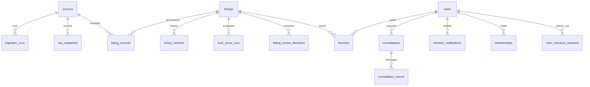

# 제품 정책과 데이터 구조

정책 근거: [DECISIONS.md](DECISIONS.md). 현재 물리 스키마는 `db/schema.ts`와 `drizzle/*.sql`이다. 아래 추가 모델은 목표이며 migration이 이미 있다는 뜻이 아니다.

## 분리해야 하는 세 축

- 자산 유형: residential/commercial/leisure/project. 국가는 별도 필터.
- 공개 Trust: S/A+/A/B+/B/C+/C/D의 8등급. 내부 score와 검수 증거를 바탕으로 표시.
- 자산 열람: Free/Basic/Standard/Premium/Business 5단계. 높은 단계는 하위 단계를 포함. 회원 요금제와 별개.

| 회원 | 월 USD | 월 KRW | 연 할인 | 포함 열람 | 관심 등록 | 코드의 AI 월 한도 |
|---|---:|---:|---:|---|---|---:|
| Explorer | 1.99 | 3,000 | 10% | Basic | 무제한 | 60 |
| Investor | 2.99 | 4,500 | 15% | Standard | 무제한 | 150 |
| Private | 10 | 15,000 | 20% | Premium | 무제한 | 400 |

USD와 KRW 회원 가격은 승인된 별도 표시 가격이다. 자산 환율 API로 매번 멤버십 가격을 바꾸지 않는다. AI 한도는 현재 데모 설정이며 실서비스 비용 검토가 남았다.

GLI Cash는 여행과 모든 GLI 상품/편의서비스에 사용할 선불 캐시다. 멤버십 결제 원장 `cash_checkout_sessions`가 있다고 GLI Cash 잔액 원장이 구현된 것은 아니다. 충전·사용·취소·환불·동시성·잔액 일치 모델은 GS-018. 이후 코인 결제는 별도 수단이며 Web2 캐시와 혼합하지 않는다.

## 현재 관계



도식은 도메인 관계 요약이다. 정확한 FK·키 타입·제약은 스키마와 migration을 읽는다. SQL에 `fingerprint`/`changed_fields_json`이 남아도 포털 간 자동 병합이나 사용자용 변경 비교를 구현하라는 요구가 아니다.

## 이식할 모델과 누락된 구조

| 영역 | 현재 | 목표/추가 작업 |
|---|---|---|
| 원문 식별 | sourceId + externalKey unique | 같은 원문 갱신, 다른 원문 독립 |
| 가격 | Asset.price, maxPrice, currency; DB priceMinor | Decimal/minor 단위 정의, 범위 끝값, 월/총액/면적단가, nullable 가격 |
| 위치 | country/city/district 문자열 | source 원문과 정규화 위치 ID 분리, 국가별 별칭 |
| 미제공 값 | 일부 0/문자열/탈락 | field value=null + missing reason; zero/studio/미상 분리 |
| 날짜 | observedAt/updatedAt 혼합 | sourcePostedAt/sourceModifiedAt/collectedAt/lastCheckedAt/verifiedAt/documentDate 분리 |
| 매물 종류 | Asset.propertyType는 condo/house/villa, 일부 검색은 land/commercial도 허용 | 자산 4분류와 부동산 subtype/project 모델 정합성 |
| 원문 증거 | R2 adapter와 raw snapshot ledger | public discovery도 같은 영구 증거 경로 사용 |
| 프로젝트 | 정적 partnerAssets/detailFacts | 프로젝트·호실·가격범위·파트너 문서 관계 |
| 자료 열람 | 데모 단계와 full report gate | 자료별 required tier, 유효기간, 구매/환불 권한 |
| 직원 보완 | review ledger 일부 | field research record, 출처/검증값 공존 |
| CMS | newsItems와 시안 HTML | news/article revision/media/scheduling |
| 검색 작업 | 요청 안에서 실행/Map | search job/result/source run/cancel/failure status |

## 필드 계약 제안

```ts
// TARGET ONLY. 현재 Asset 타입을 교체하지 않은 설계 예시.
type EvidenceField<T> = {
  value: T | null;
  state: "source_present" | "source_missing" | "fetch_failed"
    | "not_applicable" | "staff_confirmed";
  sourceRecordId: string;
  evidenceId: string | null;
  checkedAt: string | null;
  verifiedAt: string | null;
};
```

`source_missing`은 사용자에게 '조사 예정'. 나머지 상태의 상세 UI 문구는 승인 시안을 확인한다. 수집 실패를 '출처에 원래 없음'으로 바꾸지 않는다.

## 공개와 관리자 데이터

| 데이터 | 공개 | 관리자 |
|---|---|---|
| 자산명·지역·원 가격·통화·사진·공개 등급 | 승인 UI대로 | 원문/정규화 값 확인 |
| 외부 출처명·원문 매물 링크 | 실제 외부 매물에 제공 | external ID/수집 방식 포함 |
| 원문 게시 나이 | 승인된 배지 | 원문 날짜/변경/체크 시각 분리 |
| 문서작성 시점·등록 근거·검토 메모 | 카드 반복 설명에 넣지 않음 | 전체 확인 가능 |
| source 신뢰 순서·모델 공급사·프롬프트 | 표시 안 함 | 권한 있는 운영자만 |
| 상세 자료 | 자료별 열람권 | 게시/회수/검토 권한 |

자료에 없는 실제 정보는 직원 조사를 기다린다. 사용자 승인 데모 문구는 내부에 데모 근거를 남기고 이후 실데이터 교체 대상으로 추적한다. 이번 문서화는 공개 문구를 교정하는 작업을 포함하지 않는다.
